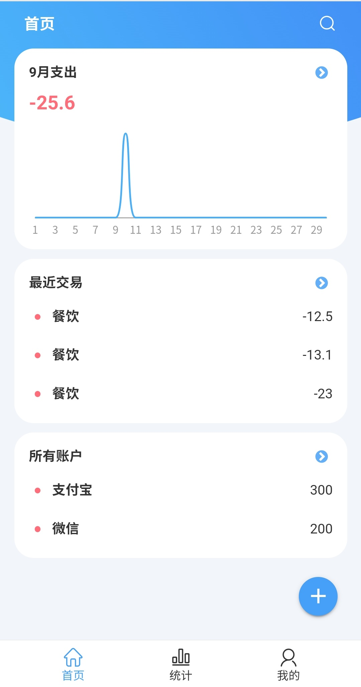
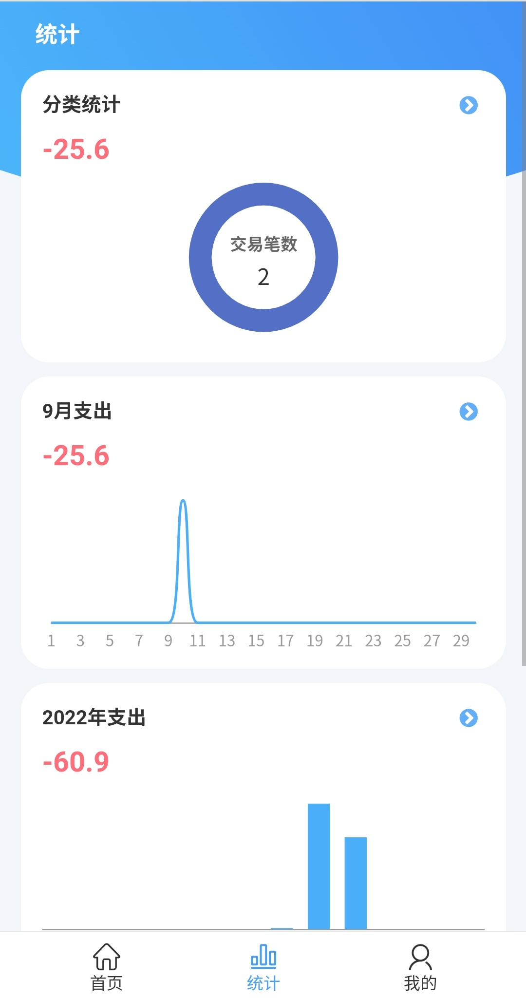
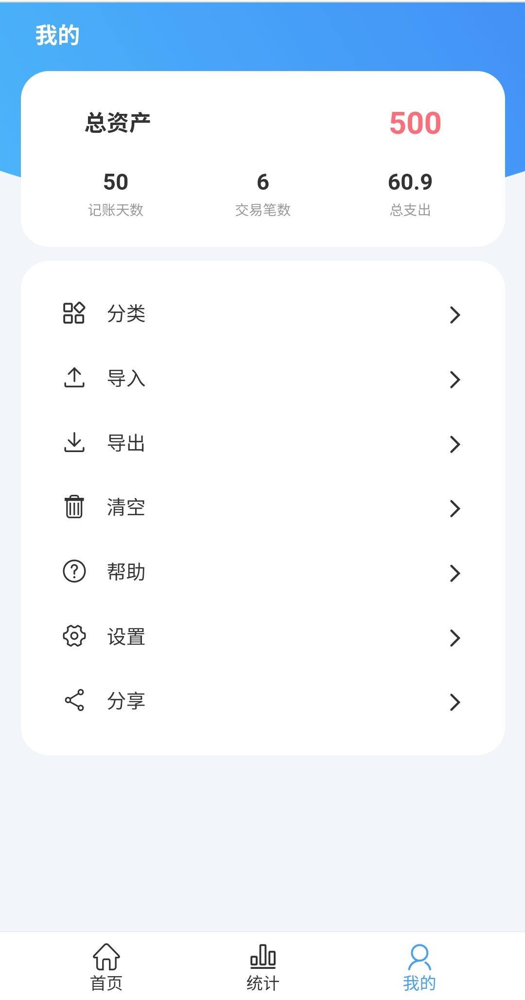
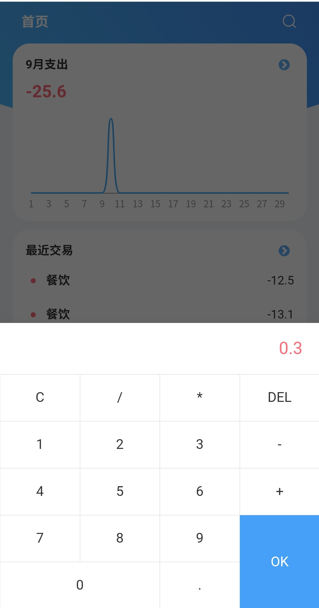
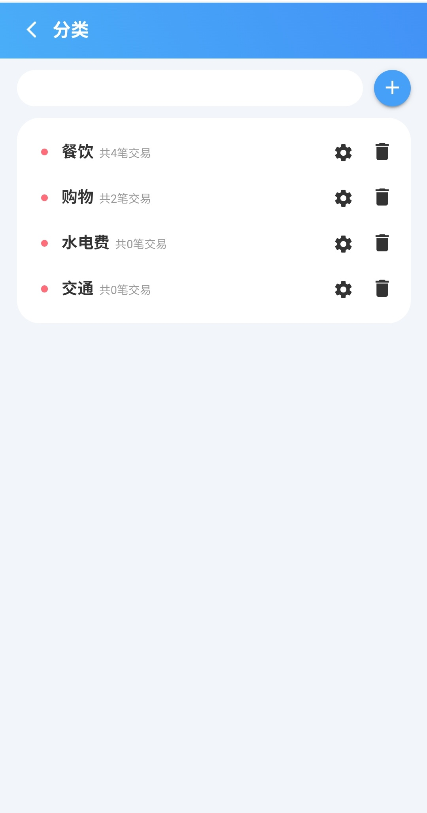
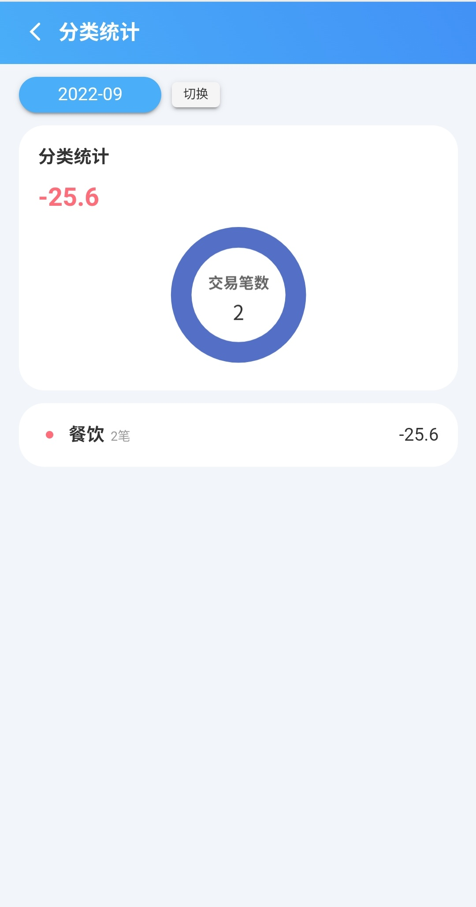
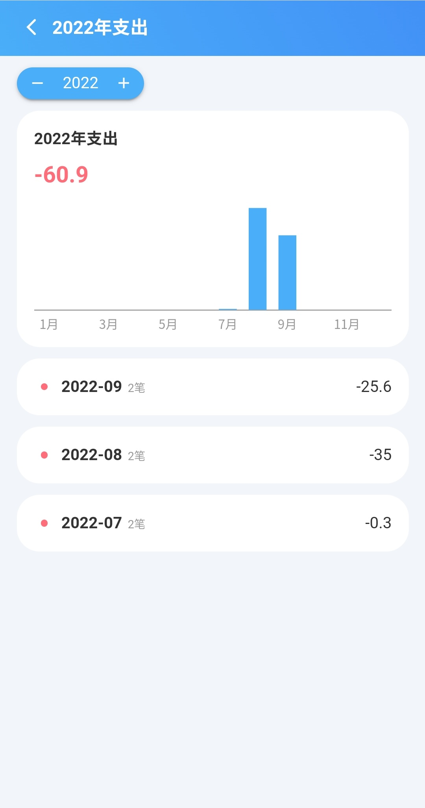

# H2记账

基于 Vue3 的极简记账 Web [在线预览](https://account.zhichao.org)

## 特点

- 无需登录，没有账号系统，不会收集任何个人信息

- 本地化存储，通过浏览器的localStorage进行存储，不会上传到服务器

- 交易系统与账户系统相互独立，降低记账的复杂度

- 支持数据的导出与导入，随时备份数据

- 可以按照分类、月份、年份、总支出进行统计，生成对应的图表

## 预览

## 内部页面

## 技术栈

- Vue 3
- Pinia
- Varlet
- Echarts
- MathJS

